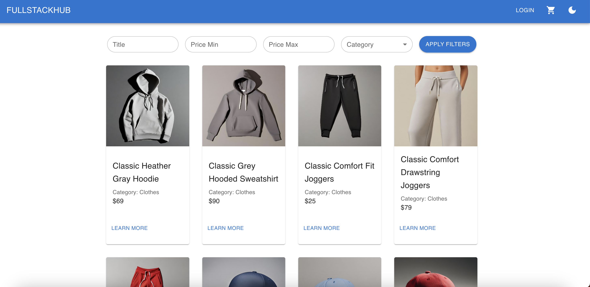
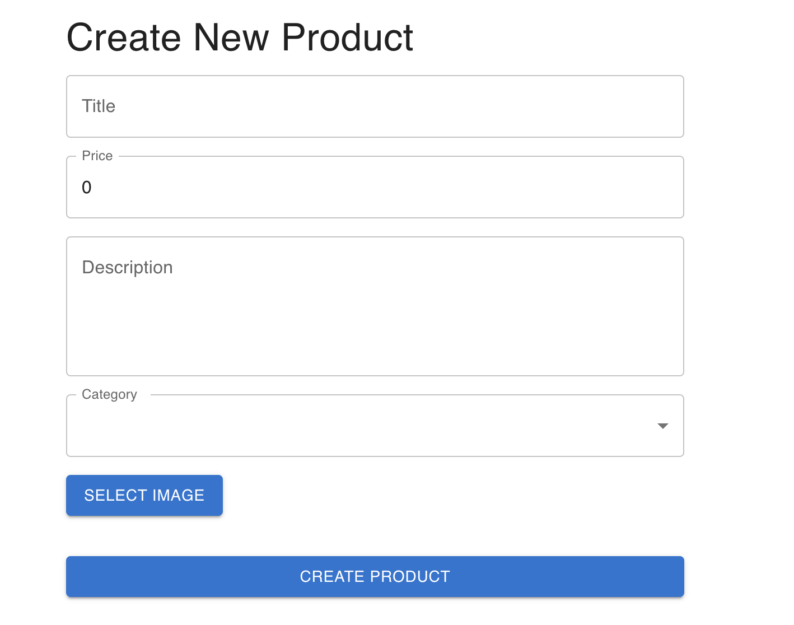
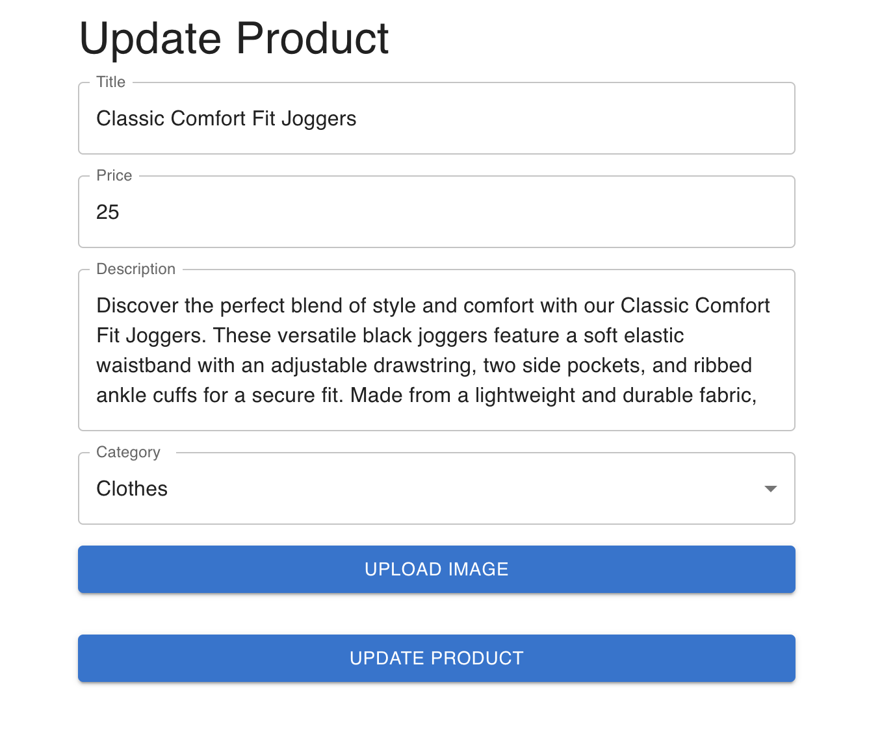
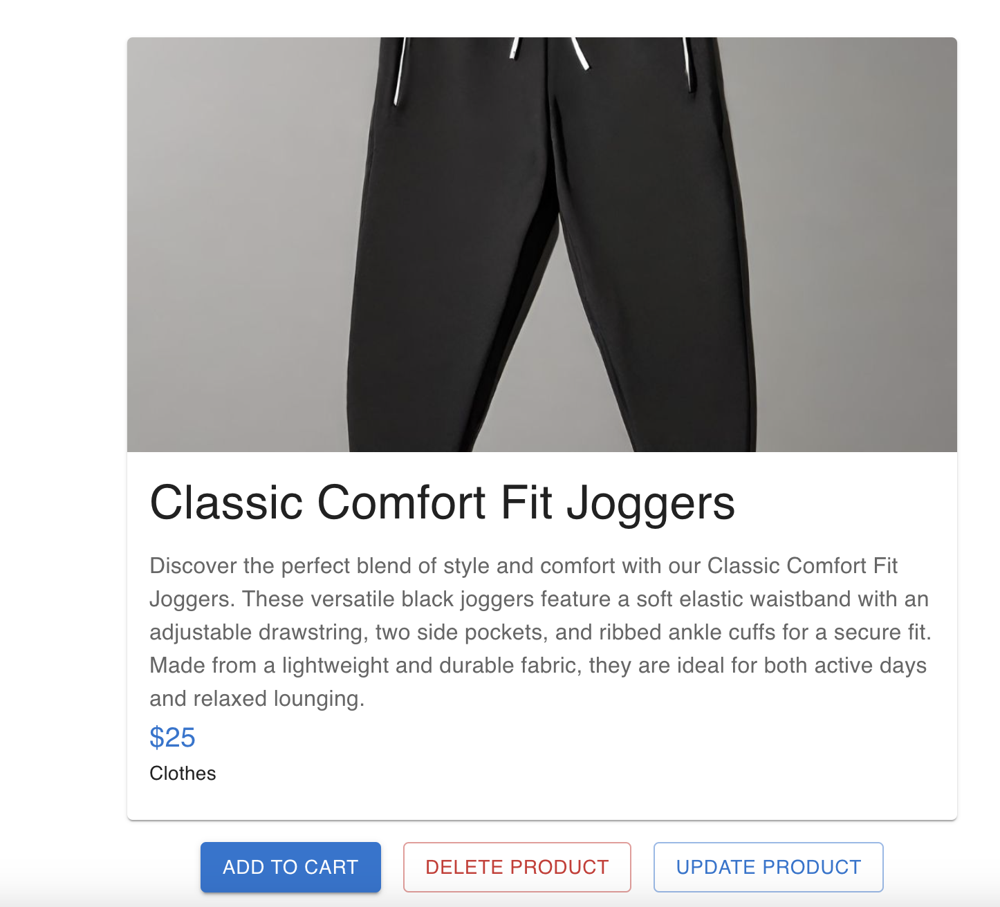
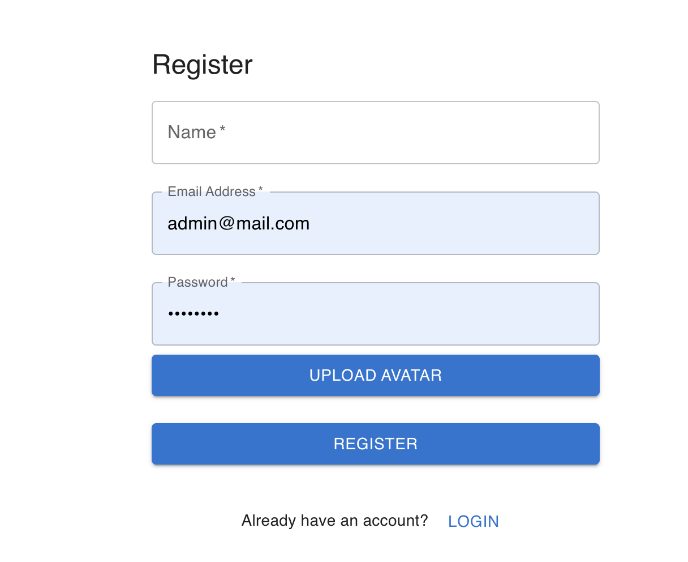
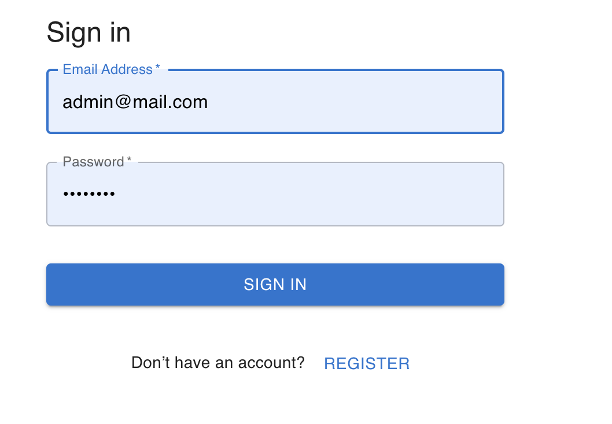
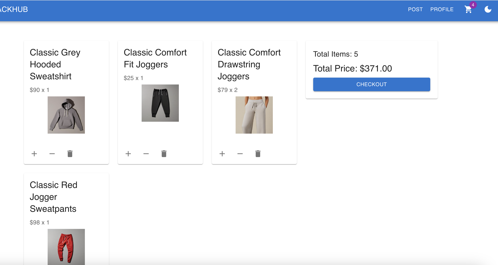
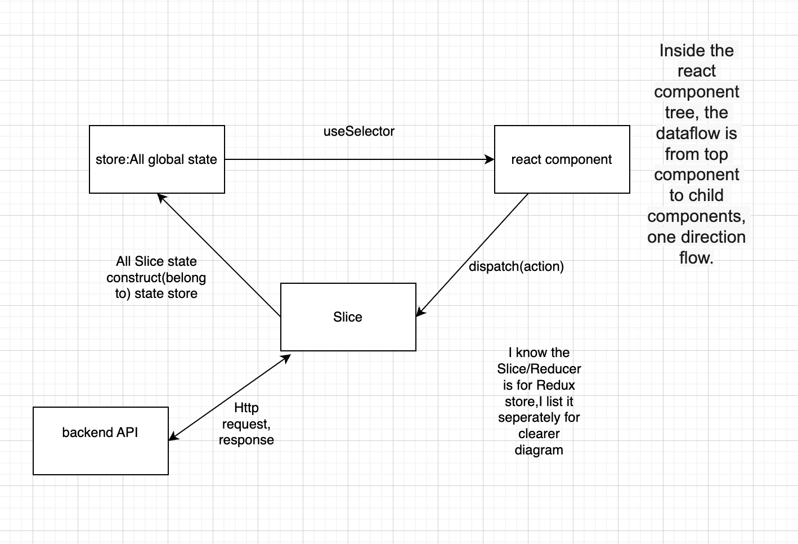
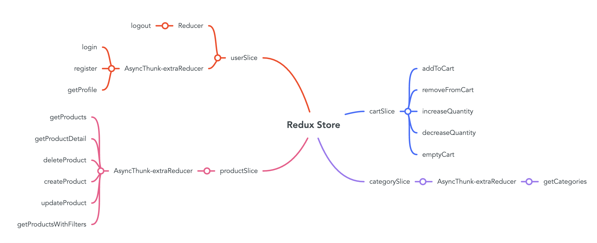

# FRONTEND PROJECT

# E-commerce Website Project

  

## 1. Introduction

  

The website live here: https://eshopping-website-iota.vercel.app/

The website APIs here:

Frontend repo:

Backend repo:
  

All features achieved:

1. Product: get all products, find a single products, Joint Search: search products by name + filter products by categories + sort products by price range. Create, update and delete a product

2. User: register, login, logout, get profile, update profile

3. Shopping cart: add product to cart, remove products, update products's quantity in cart, checkout
 
4. Order: create order(checkout shopping cart), get orders, delete order

5. Category: create category, get categories, delete category

6. Context API to switch theme

7. Applying pagination when fetching/displaying all the products

8. Styling: responsive

  **Permission Structure: Three Levels of Permissions**

1.  **Visitor**: Browse products, filter products, log in, create user accounts.
2.  **Logged-in User**: Add products to shopping cart, checkout (create order), delete order, update profile.
3.  **Admin**: Add, delete, and modify products; add and delete categories.

This e-commerce website project aims to provide a seamless shopping experience, featuring a comprehensive interface with pages It leverages Redux for efficient state management across product browsing, user authentication, and cart functionalities, including filtering, sorting, and admin-specific operations. Enhanced by theme switching, pagination, and performance optimization. The site ensures an engaging, accessible, and smooth experience for all users. Private routing, responsive design, and unit testing further enhance security and usability, making it a versatile solution for online shopping needs.

  

### Technology Stack

-  **React** for framework

-  **Redux Toolkit** for state management

-  **React Router** for router management

-  **Typescript** for programming language

-  **Material UI** for styling

-  **Jest and msw** for testing

  

## 2. Table of Contents

  

- [Introduction](#1-introduction)

- [Table of Contents](#2-table-of-contents)

- [Getting Started](#3-getting-started)

- [Prerequisites](#prerequisites)

- [Installation](#installation)

- [Running the Project](#running-the-project)

- [Usage](#4-usage)

- [Architecture & Design](#5-architecture--design)

- [Project Structure](#project-structure)

- [Data Flow](#data-flow)

- [Redux structure](#redux-structure)

- [Deployment](#6-deployment)

  

## 3. Getting Started

  

### Prerequisites

  

Before you begin, ensure you have the following software and tools installed on your system:

  

-  **Node.js**: Version 16.18.80 or newer.

  

### Installation

  

To get started with the project, the first step is to clone the repository to your local machine. Open your terminal and run the following git command:

  

```bash

git  clone  https://github.com/xiaoShuZhou/fs17-Frontend-project.git

```

After cloning the project, navigate to the project directory and install the required dependencies by running:

```bash

npm  install

```

Running the Project

```bash

npm  start

```

## 4. Usage

### Production build

This script compiles the app into static files for production in the build folder.

```bash

npm  build

```

### Test

```bash

npm  test

```

  

This script compiles the app into static files for production in the build folder.

### Features

1. Product: get all products, find a single products, search products by name, filter products by categories, sort products by price. Create, update and delete a product (enable update & delete features only for admin of the webapp)









2. User: register and login





3. Shopping cart: add product to cart, remove products, update products's quantity in cart



## 5. Architecture & Design

  

### Project Structure

-  **src**

-  **components**

-  `Filter.tsx`

-  `Header.tsx`

-  `Login.tsx`

-  `Pagination.tsx`

-  `Register.tsx`

-  `ThemeContext.tsx`

-  `ThemeToggleButton.tsx`

-  **misc**

-  `constants.ts`

-  `uploadFileService.ts`

-  **pages**

-  `Auth.tsx`

-  `Cart.tsx`

-  `CreateProduct.tsx`

-  `ProductDetail.tsx`

-  `Products.tsx`

-  `Profile.tsx`

-  `UpdateProduct.tsx`

-  **redux**

-  **slices**

-  `cartSlice.ts`

-  `categorySlice.ts`

-  `productSlice.ts`

-  `userSlice.ts`

-  `store.ts`

-  `hooks.ts`

-  **test**

-  **cart**

-  `cartReducer.test.ts`

-  **category**

-  `categoryReducer.test.ts`

-  **product**

-  `productReducer.test.ts`

-  **mockdata**

-  `cart.ts`

-  `category.ts`

-  `product.ts`

-  `user.ts`

  

-  **testServer**

-  `categoryServer.ts`

-  `productServer.ts`

-  `userServer.ts`

-  **user**

-  `userReducer.test.ts`

-  **types**

-  `cart.ts`

-  `category.ts`

-  `product.ts`

-  `user.ts`

-  `App.test.tsx`

-  `App.tsx`

-  `index.tsx`

-  `react-app-env.d.ts`

-  `reportWebVitals.ts`

-  `setupTests.ts`

-  `package.json`

  

-  **src**: The source code for the application.

-  **components**: Reusable React components.

-  **misc**: Utility folder for miscellaneous items.

-  **pages**: Components that represent whole pages or routes.

-  **redux**: Contains the state management files used by Redux.

-  **slices**: State and reducers for specific features.

-  **hooks.ts**: Custom hooks for accessing the state and dispatching actions.

-  **test**: Testing files related to Redux Reducer logic.

-  **types**: TypeScript type definitions and interfaces.

  

The **App.tsx** file is the root React component, and **index.tsx** is the entry point of the React app.

  

### Data Flow



### Redux structure



## 6. Deployment

The website is deployed with Vercel. I choose Vercel because it provides a set of CI/CD pipelines so it can redeploy my project in real time when I change my github repo.